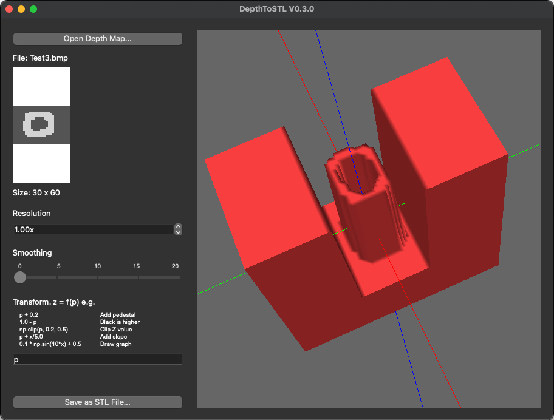

DepthToSTL
==========

DepthToStl creates 3D models from greyscale depth map images and allows the user to view the model as a 3D structure and then output it to an STL file. The current version of this program work on a Mac, but is based on an original version I wrote in 2016 for the PC.

The input image is a 2D plan and the third dimension, the luminance of the pixel is the height of that part of the structure. Images from depth sensing cameras frequently produce their results in this format.


Installation
------------

* The program requires a 2020 or newer version of Python to avoid the problem with PyOpenGL described in https://stackoverflow.com/questions/63475461/unable-to-import-opengl-gl-in-python-on-macos. I am using Python 3.10.2.

* The program uses the following libraries:
    - PySide6
    - PyOpenGL
    - opencv-python
    - PyOpenGL-accelerate (patched)

* To set up virtual environment first time - from this directory:  
  ```
  % python -m venv venv
  % source venv/bin/activate
  % python -m pip install --upgrade pip
  % pip install -r requirements.txt

  # Install a patched version of PyOpenGL-accelerate
  % pip download PyOpenGL-accelerate -d temp
  % cd temp
  % tar xf PyOpenGL-accelerate-3.1.5.tar.gz
  % patch PyOpenGL-accelerate-3.1.5/src/vbo.c < ../PyOpenGL-accelerate-3.1.5_vbo_patch 
  % pip install ./PyOpenGL-accelerate-3.1.5
  % cd ..
  % rm -rf temp
  ```

Running
-------

Run the program with:

```
.\DepthToSTL.py
```



* The input file can be RGB or greyscale, and is converted to greyscale. The higher the luminance, the "taller" the structure.

* The resolution that the program works to is controlled by thw Resolution setting. This can be in the range 0.1 to 2.0. When an image is first loaded the resolution is set so the longest image dimension is no more than 300 pixels. Beware of large images which can have very long processing times if their resolution isn't reduced.

* Smoothing, in the form of a Gaussian Blur can be applied with the Smoothing slider. The slider value is the radius of the blur.

* Transform allows an arbitrary operation to be performed on image pixels. This can add a pedestal, clip the image or even replace the image with an equation in (x,y).

* The program can output an STL file for making a physical model of the image with a 3D printer. The STL file scales the model to be of unit size in the largest of the x or y dimensions. Models can be scaled by the 3D printer to create whatever size of object is desired.


Useful Websites
---------------

### PySide
http://zetcode.com/gui/pyqt4/  \
https://doc.qt.io/qtforpython-6/

### PyOpenGL
http://winfred-lu.blogspot.co.uk/2012/09/writing-your-first-pyqt4-opengl-program.html

### General
https://en.wikipedia.org/wiki/STL_(file_format)


Tour of Files
-------------

| Directory/file                         | Description |
|----------------------------------------|-------------|
|ArcBall.py                              | Sub-module converting mouse clicks and drags to model rotation during viewing |
|DepthToSTL.pyw                          | Main program. Run with `.\DepthToSTL.pyw` |
|LICENSE                                 | The code is licensed under an MIT license |
|PyOpenGL-accelerate-3.1.5_vbo_patch     | Diff patch file to fix compile errors in PyOpenGL-accelerate-3.1.5 `vbo.c` |
|README.md                               | This file |
|requirements.txt                        | Packages to be installed by pip install |
|ScaleSlider.py                          | Sub-module providing slider GUI used for smoothing value |
|Screenshot.png                          | Screenshot of DepthToSTL.pyw running |
|Test1.bmp                               | Test file |
|Test2.bmp                               | Test file |
|Test3.bmp                               | Test file |
|Tsukuba.jpg                             | Example depth image - from seminal stereo disparity paper |
